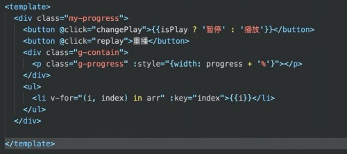

# 需求

实现一个进度条，带有暂停和播放功能，效果图大致如下：


功能不是很复杂，感觉也没有什么技术难度，我首先想到的是用一个定时器来实现这个功能，按钮可以控制定时器的开始和暂停，下面使用vue来实现第一版。

# 定时器实现

代码如下：


```
<script>
let timer， totalTime = 3000;
export default {
  name: "Progress",
	data() {
		return {
			isPlay: false,
			progress: 0
		}
	},

	methods: {
		run() {
			timer = setInterval(() => {
				const {progress} = this;
				this.progress = progress + 2;
				if(this.progress === 100) {
					this.cancel();
				}
			}, 3000/ 100)
		},
		cancel() {
			clearInterval(timer);
			timer = null;
		},
		changePlay() {
			const { isPlay } = this;
			this.isPlay = !isPlay;
			if(this.isPlay) {
				this.run();
			} else {
				this.cancel();
			}
		},
		replay() {
			this.isPlay = true;
			this.progress = 0;
			this.run();
		}
	}
};
</script>

<!-- Add "scoped" attribute to limit CSS to this component only -->
<style scoped>
	.g-contain {
		width: 240px;
		height: 25px;
		border-radius: 25px;
		background: #eee;
		overflow: hidden;
}
	.g-progress {
		height: inherit;
		border-radius: 25px 0 0 25px;
		background: #0f0;
	}
</style>
```

通过定时器来快速递增变量 `progress`以此来实现进度增加的，变量每次改变都会驱动视图重新计算渲染，并且会导致整个页面不断的重拍重绘制。如果项目不是很复杂，貌似问题也不大，如果遇到大型的项目，或者页面dom节点比较多的项目，将会感觉到明显的卡顿。

测试：

给页面增加元素10000万个，

```json
data() {
		return {
			isPlay: false,
			progress: 0,
			arr: []
		}
	},
	created() {
		for(let i = 0; i < 100000; i ++) {
			this.arr[i] = i;
		}
	},
```



点击播放按钮，可以看到页面变卡了，播放变慢了。

# 优化1

使用css动画。


```js
<script>
export default {
  name: "Progress",
	data() {
		return {
			isPlay: false,
			type: 0, // 0播放, 1 重播
			totalTime: 2
		}
	},
	methods: {
		end(){},

		changePlay() {
			const { isPlay } = this;
			this.isPlay = !isPlay;
		},
		replay() {
			const { type } = this;
			this.isPlay = true;
			this.type = type ? 0 : 1;
		}
	}
};
</script>

<!-- Add "scoped" attribute to limit CSS to this component only -->
<style scoped>
	@keyframes play { 
    to {width: 100%}  
	}

	@keyframes replay {
    to {width: 100%}  
	}
	.g-contain {
		width: 240px;
		height: 25px;
		border-radius: 25px;
		background: #eee;
		overflow: hidden;
}
	.g-progress {
		width: 0;
		height: inherit;
		border-radius: 25px 0 0 25px;
		background: #0f0;
		/* animation-timing-function: linear; */
		-webkit-animation-timing-function: linear;
	}
	.g-progress.play {
		animation: play 3s infinite linear;
	}
	.g-progress.replay {
		animation: replay 3s infinite linear;
	}
	.g-progress.animationplay {     /* 使animation动画启动 */
		animation-play-state: running;
    -webkit-animation-play-state: running;
	}

	.g-progress.animationpause {    /* 使animation动画暂停 */
		animation-play-state: paused;
		-webkit-animation-play-state: paused;
	}
</style>

```

使用css3关键帧动画，控制进度条的变化，减少了很多计算，在一定程度上减少了性能的消耗。

但是这种方式依然会频繁的触发整个页面的重排和重绘。

渲染长列表组件看下效果：

List.vue

```
<template>
	<ul>
		<li v-for="(i, index) in arr" :key="index">{{i}}</li>
	</ul>
</template>

<script>
export default {
  name: "List",
	data() {
		return {
			arr: []
		}
	},
	created() {
		for(let i = 0; i < 100000; i ++) {
			this.arr[i] = i;
		}
	}
};
</script>


```

引入注册使用：

```
import List from './List.vue'
components: {
    List
  },
```

播放过程中，虽然也有卡顿，但是比上一个方案好了很好，这里不方便看结果，最后附上代码，可以下载测试。

## 优化2

使用css动画，开启GPU加速，GPU主要负责3D绘制和硬件加速。

这种方案给优化1逻辑和页面结构上没有啥区别，不同的地方在样式：

```css
<style scoped>
@keyframes play { 
    0% {  
      transform: translateX(-50%) scaleX(0);  /* 用 scaleX 来代替 width */
    }
    to {
	transform: translateX(0) scaleX(1);
    }
}
@keyframes replay {
    0% {  
      transform: translateX(-50%) scaleX(0);  /* 用 scaleX 来代替 width */
    }
		to {
					transform: translateX(0) scaleX(1);
		} 
	}
	.g-contain {
		width: 240px;
		height: 25px;
		border-radius: 25px;
		background: #eee;
		overflow: hidden;
}
	.g-progress {
		width: 100%;
		height: inherit;
		border-radius: 25px 0 0 25px;
		background: #0f0;
                will-change: transform; /**通知浏览器提前过好优化 */ 
		animation-timing-function: linear;
		-webkit-animation-timing-function: linear;
	}
	.g-progress.play {
		animation: play 3s infinite linear;
	}
	.g-progress.replay {
		animation: replay 3s infinite linear;
	}
	.g-progress.animationplay {     /* 使animation动画启动 */
		animation-play-state: running;
    -webkit-animation-play-state: running;
	}

	.g-progress.animationpause {    /* 使animation动画暂停 */
		animation-play-state: paused;
		-webkit-animation-play-state: paused;
	}
</style>


```

利用will-change: transform; /**通知浏览器提前过好优化 */

利用transform开启GPU加速。

进入List组件测试一下会发现页面明显的卡顿消失了。

总结：

在使用动画的时候，可以通过让页面形成不同的复合层来达到优化性能的目的。

开启的方式：

* 3D 或透视变换(perspective transform) CSS 属性
* 使用加速视频解码的`video>`元素 拥有 3D
* (WebGL) 上下文或加速的 2D 上下文的`canvas` 元素
* 混合插件(如 Flash)
* 对自己的 opacity 做 CSS动画或使用一个动画变换的元素（以前的浏览器，目前这种方式依然会造成重绘和重排列）
* 拥有加速 CSS 过滤器的元素
* 元素有一个包含复合层的后代节点(换句话说，就是一个元素拥有一个子元素，该子元素在自己的层里)
* 元素有一个z-index较低且包含一个复合层的兄弟元素(换句话说就是该元素在复合层上面渲染)